# marknoveler

一个适用于小说等文本阅读类型 markdown 转 html 并自动部署 Pages 的小工具（支持实时预览）。

## 简介

本工具使用 marked 对 md 进行转换，配合自定义 js 和 css，实现对阅读友好。同时使用 live-server 实现实时预览效果。

对于有基础的同学，仅需 fork 该仓库，然后授予 actions 权限并开启，将小说 md 置于 src 之中后 push，最后对 gh-pages 分支启用 pages 即可。

## 运行项目

- build: 构建所有 md

- dev: 实时预览

## 预览

## 快速上手

1. 首先，将本仓库 fork 为自己的仓库

   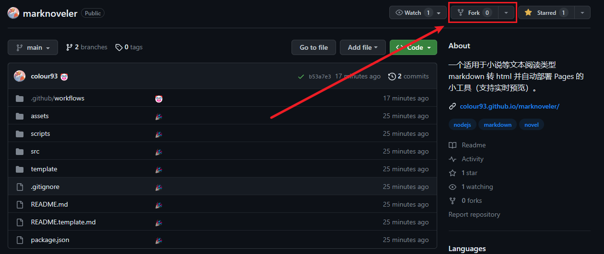

   > fork 详细参数如果有 git 基础可以跳过。

   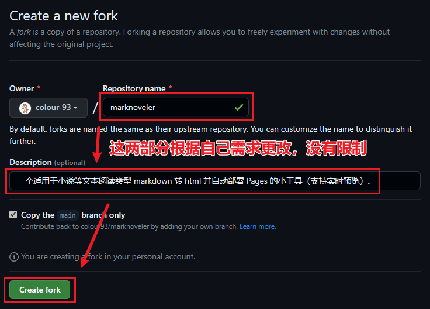

2. 然后，修改 GitHub Actions 的操作权限

   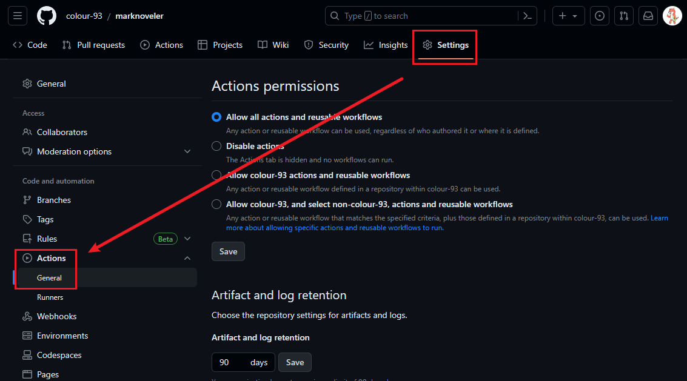

   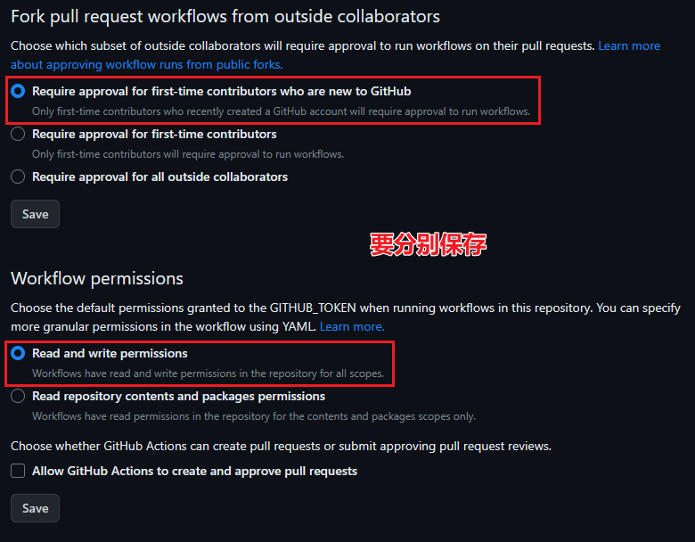

3. 打开 fork 仓库的 Actions 功能

   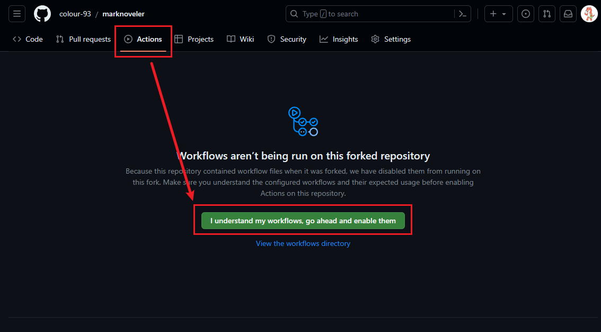

4. 接下来有两个选择：

   - [使用 GitHub Codespaces（适用于0基础）](#使用-GitHub-Codespaces)

   - [使用本地的 VS Code 和 git，将仓库 clone 并修改文件，而后 push（适用于有 git 基础的）](#使用-VS-Code-和-git)

   ### 使用 GitHub Codespaces

   0. 首先将 Codespaces 功能启用

      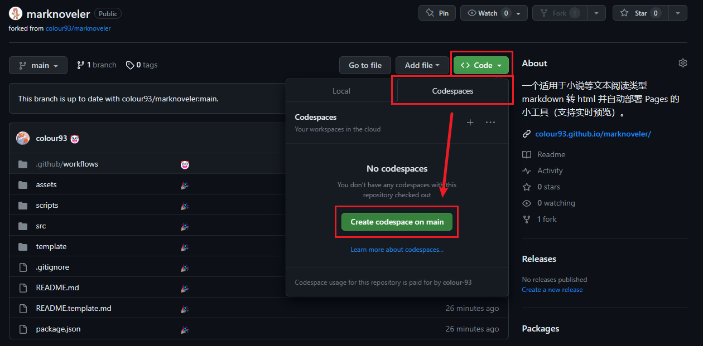

   1. 将小说 md 置于 src 中

      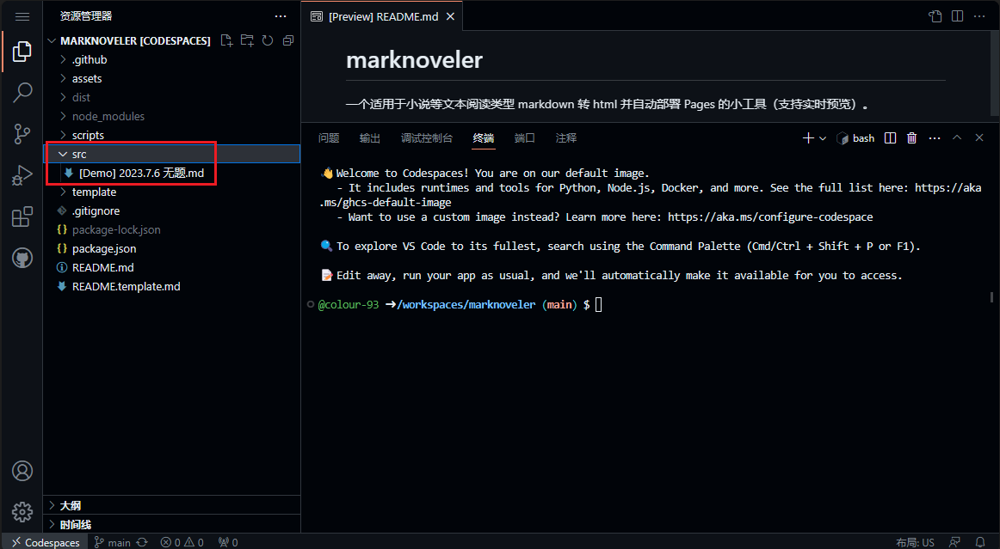

   2. 如果有需要，在 codespaces 环境中同样可以完成实时预览，仅需输入 `npm run dev` 命令

      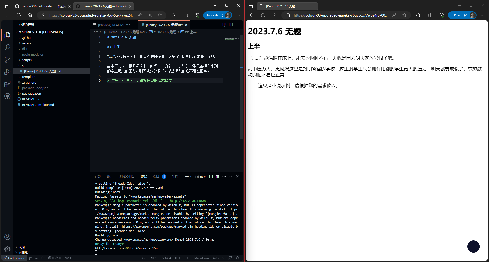

   ### 使用 VS Code 和 git

   1. 将仓库 clone 到本地后，使用 VS Code 打开并将小说 md 置于 src 中

      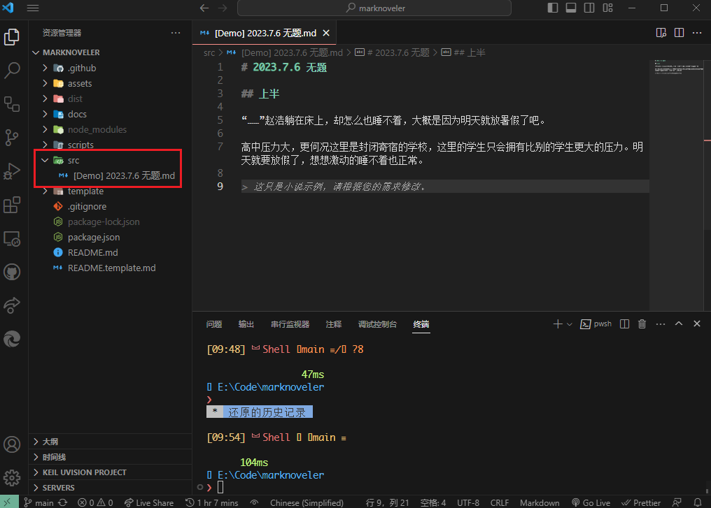

   2. 如果有需要，在 vs code 环境完成实时预览，需事先安装 `nodejs >= 18`，而后 `npm i && npm run dev`

      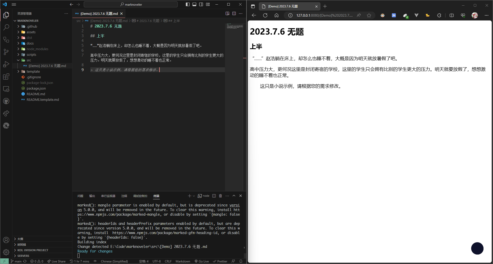

   最后别忘了 commit 并 push 到仓库。

5. 启用 GitHub Pages 功能

   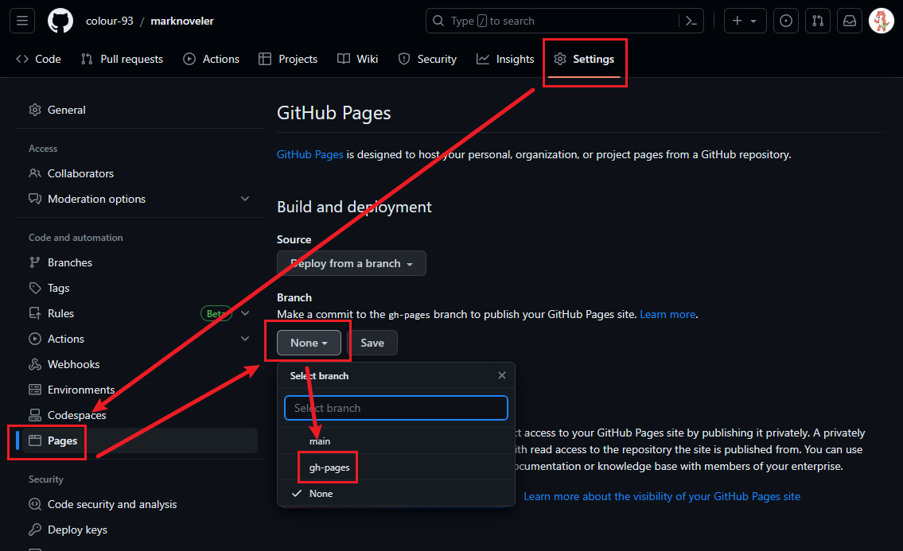

   了解 Pages 的同学可以自己配置域名。

6. 访问 `你的 GitHub ID` + `.github.io` + `/` + `本仓库名`

   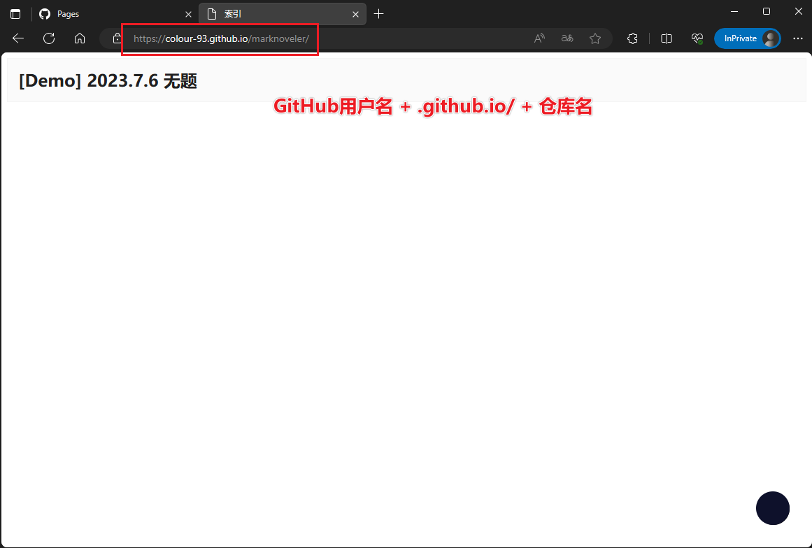
